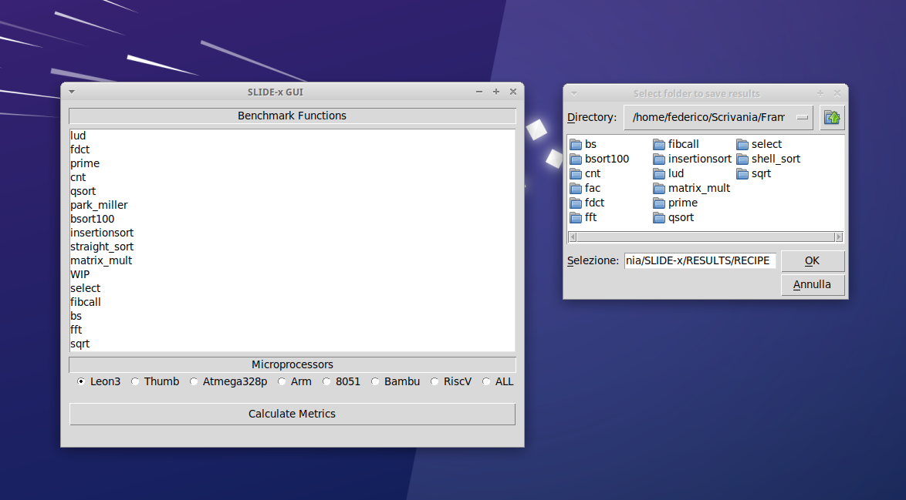

# SLIDE-x
**S**ystem-**L**evel **I**nfrastructure for HW/SW **D**ataset **E**-**x**traction

## Installation instructions

### OVERVIEW
 SLIDE-x is an open-source Python tool that facilitates the co-design of HW and SW for embedded systems and cyber-physical systems (CPSs) through the creation of datasets useful for analysis, comparison, and simulations/predictions. These datasets can be used to evaluate HW/SW performance, select the most suitable embedded platform, and perform HW/SW trade-off analysis.

### SLIDE-x Main Components
SLIDE-x consists of several components:

1. **SLIDE-x-Bench**: Extensible C-based benchmark for evaluating HW/SW performance.
2. **SLIDE-x-CORE**: The SLIDE-x core (kernel) component
   - **SLIDE-x-Data**: Extensible Python Data-driven component, where designers can (semi)automatically generate inputs for the benchmark functions. The function parameters are specified in a JSON file (`cmds.json`) contained in the same directory of the function. The component reads a range `[x; y]` used to generate the values of the parameters and the number of inputs to be created. Finally, for each function, different data types have been considered (i.e., int8, int16, int32, int64, float, and double) to analyze the results for the internal  architecture of the considered processor.
   - **SLIDE-x-Code**: Extensible Python Code-driven component, where several code-oriented metrics are extracted by profiling the benchmark functions using the `gcov` and `frama-c` tools for each generated input. It is worth noting that such profiling is performed one-shot on the host platform since it is independent of the target processor technologies.
   - **SLIDE-x-Sim**: Extensible Python HW/SW Simulation-driven component, where designers can execute the benchmark C function using several simulators for different processors. The component saves metrics related to the number of clock cycles, instructions executed, cache miss/hit/access, etc. Depending on the processor technology, an Instruction Set Simulator (ISS) or an HDL Simulator is needed, such as:
     - **SLIDE-x-HLS** Integration with High-Level Synthesis (HLS) tools such as Bambu, Vitis-HLS, and LegUP.
     - **SLIDE-x-ISS** Integration with Instruction Set Simulators (ISS) such as TSIM, Armulator, Thumbulator, Dalton SDCC/ISASIM, SimulAVR, Spike 64-bit RISC-V, x86-64 with Perf.
3. **SLIDE-x-AGGR**: Extensible Python dataset Aggregator component for aggregating datasets generated during the Profiling/Simulation activities. It also offers functionalities for implementing unified HW/SW metrics (e.g., CC4CS, CC4IR, CC4SSA, CC4OPT), performing statistical analysis, and comparing different platforms.
4. **SLIDE-x-ML**: HW/SW ML-based component for creating HW/SW co-design ML models using machine learning frameworks and tools, including MATLAB Statistics and Machine Learning Toolbox (for MATLAB) and TensorFlow/Keras/PyTorch/Scikit-Learn (for Python).

SLIDE-x supports synthesis for FPGAs through the **SLIDE-x-FPGA** parser and System-on-Chips (SoCs) through the **SLIDE-x-SoC** parser. Application-Specific Integrated Circuit (ASIC) support is under development.

SLIDE-x can be used to enhance Systel-Level HW/SW Co-Design frameworks and tools functionalities such as HEPSYCODE, a System-Level methodology and tool for HW/SW **CO-DE**sign of **HE**terogeneous **P**arallel dedicated **SY**stems. The enhanced version is called **HEPSYCODE-x**. SLIDE-x can be also used to define metrics for exploring the design space of embedded systems and CPSs. It has been used in HEPSYCODE to improve the `Partitioning, Architecture definition, and Mapping` (PAM) design space exploration tool. The improved version, called **PAM-x** uses GIMPLE-SSA-OPTIMIZED intermediate representations.

### WEBSITE
[www.HEPSYCODE.com](https://hepsycode.github.io/)

### DOWNLOAD
SLIDE-x is open-source and freely available on GitHub: https://github.com/hepsycode/SLIDE-x.

### SCREENSHOT

### INSTALLATION
The installation of the framework goes through a few simple steps. All that is required is to install the tools exploited by the framework at each step: Profiling (i.e., gcov), Static Analysis (i.e., Frama-c), and Simulation (i.e., ISS/HLS). For a deeper insight into the commands executed to perform each phase, the user can look at the `/SLIDE-x-CORE/src/cmds.json` file.

The framework is implemented in Python3 and uses the csv, os, shutil, subprocess, tkinter libraries for internal operations. Thus, Python3 and the above-listed libraries should be installed for the framework to run properly. 

#### Profiling
The profiling phase requires the execution of [gcc](https://gcc.gnu.org/gcc/) and [gcov](https://gcc.gnu.org/onlinedocs/gcc/Gcov.html).

#### Static Analysis
This step requires the [frama-c](https://frama-c.com/) software analyzer.

#### Simulation 
The simulation phase involves the execution of the toolchain of each processor supported by the framework. The following is a description of each supported processor and the tools needed to get the information required to calculate CC4CS:

- Atmega328p: 
	- **[simulavr](https://www.nongnu.org/simulavr/)** : the instruction set simulator of the Atmega328p;
	- **[avr-gcc](https://gcc.gnu.org/wiki/avr-gcc)** : the cross-compiler for the AVR ISA;

- Leon3: 
	- **[tsim-leon3](https://www.gaisler.com/index.php/downloads/simulators)** : the instruction set simulator for the LEON3;  
	- **[sparc-gaisler-elf-gcc](https://www.gaisler.com/index.php/downloads/compilers)** : the cross-compiler for the SPARC ISA;

- 8051:
	- **[sdcc](http://sdcc.sourceforge.net/)** : the cross-compiler for the 8051;
	- **[isasim](http://www.newit.gsu.by/resources/CPUs/i8051/VHDL/Synthesizeable%20VHDL%20Model%20of%208051.htm)** : the simulator of the 8051;

### RELEASE NOTES
Latest Release: 2.0.0
 
### LICENSE
GNU GENERAL PUBLIC LICENSE Version 3, 29 June 2007 (see https://www.gnu.org/licenses/gpl-3.0.en.html)
 
### DEVELOPER RESOURCES
Source Repositories: [https://github.com/hepsycode/SLIDE-x](https://github.com/hepsycode/SLIDE-x)

- Clone: 
    - ssh: [git@github.com:hepsycode/SLIDE-x.git](git@github.com:hepsycode/SLIDE-x.git)
    - https: [https://github.com/hepsycode/SLIDE-x.git](https://github.com/hepsycode/SLIDE-x.git)
 
You can use the code from these repositories to experiment, test, build, and create patches, and issue pull requests (only by request).
For any bug or doubt, contact us or open an issue.
 
### SUPPORT
We currently support:

 1. Email: 
    - Luigi Pomante, luigi.pomante@univaq.it
    - Vittoriano Muttillo:
       - vittoriano.muttillo@guest.univaq.it,
       - vmuttillo@unite.it
       - vittoriano.muttillo@gmail.com
    - Vincenzo Stoico, v.stoico@vu.nl
    - (please take care to use \[SLICE-x SUPPORT\] as object
 2. Issues on GitHub
 
## Getting Started Guidelines
To get started with SLIDE-x, you can:

 1. Clone this repository to your local machine.
 2. Import the plugin projects in the HEPSYCODE-GUI directory in Eclipse.
 3. Use the HEPSYCODE Sirius-based tool to create and edit your HEPSYCODE models.
 4. Generate code from your HEPSYCODE models using the HEPSYCODE M2M XText transformation code.
 5. Simulate your HEPSYCODE models using the HEPSYCODE HEPSIM2 simulator. Examples are available in the HEPSYCODE-Workbench folder.

## Additional information
Research publications are available at https://hepsycode.github.io/ and http://www.pomante.net/sito_gg/Publications.htm

## How to Cite?

Coming soon
