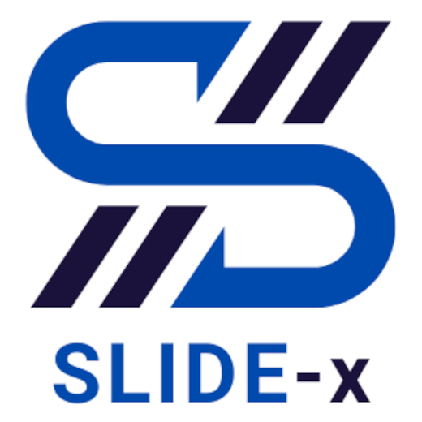

# SLIDE-x
**S**ystem-**L**evel **I**nfrastructure for HW/SW **D**ataset **E**-**x**traction

# SLIDE-x Main Components:
1. **SLIDE-x-Bench**: Extensible C-based Benchmark
2. **SLIDE-x-CORE**:
   - **SLIDE-x-Data**: Extensible Python Data-driven Module
   - **SLIDE-x-Code**: Extensible Python Code-driven Module
   - **SLIDE-x-Sim**: Extensible Python HW/SW Simulation-driven Module
     - **SLIDE-x-HLS** (e.g., Bambu, Vitis-HLS, LegUP)
     - **SLIDE-x-ISS** (e.g., TSIM, Armulator, Thumbulator, Dalton, SimulAVR, Spike 64-bit RISC-V, x86-64 with Perf)
3. **SLIDE-x-AGGR**: Extensible Python dataset Aggragator, with Unified HW/SW metric (e.g., CC4CS, CC4IR, CC4SSA, CC4OPT), statistical models and analysis, and platform comparison
4. **SLIDE-x-ML**: HW/SW ML-based Models with Matlab Statistics and Machine Learning Toolbox and Python TensorFlow/Keras/PyTorch/Scikit-Learn Frameworks
5. Support for FPGA (i.e., **SLIDE-x-FPGA**) and SoC (i.e., **SLIDE-x-SoC**) Target Form Factor, ASIC WIP.
6. **HEPSYCODE-x**: HEPSYCODE enhanced with SLIDE-x extensions 
7. **PAM-x**: PAM1 & PAM2 Design Space Exploration enhanced with SLIDE-x extensions (GIMPLE-SSA-OPTIMIZED Intermediate Representations)
